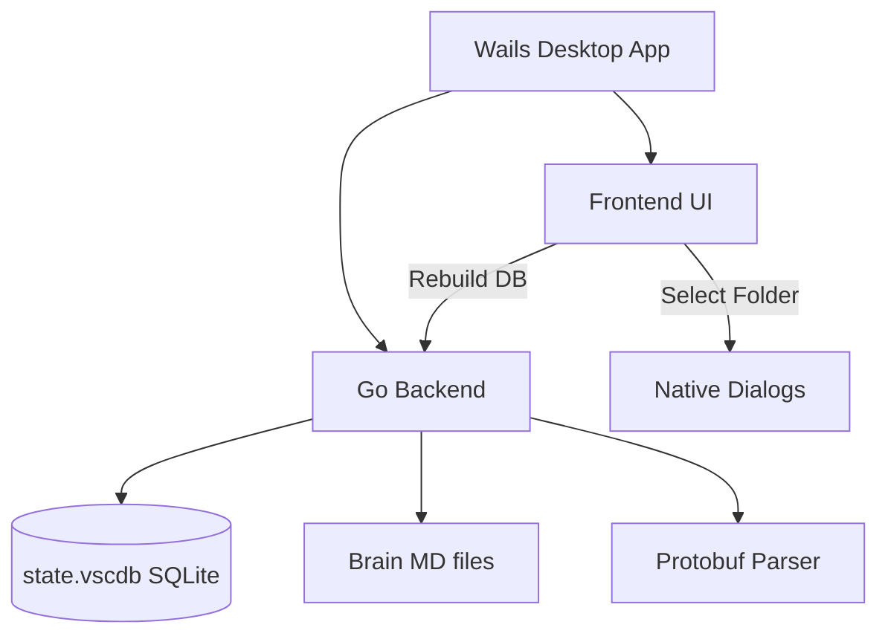

# ⚓ GravityAnchor

[](https://golang.org)
[](https://wails.io)
[](LICENSE)
[](#)

> [!NOTE]
> **GravityAnchor** is a premium, open-source desktop utility designed to scan, restore, repair, and anchor **Antigravity (Gemini-powered AI coding agent)** conversation histories, trajectories, and local workspace links.

Have your local Antigravity conversations lost their titles, timestamps, or folder associations after a system migration, backup restore, or workspace change? GravityAnchor is here to repair and sync them seamlessly.

---

## ✨ Features

- 🔍 **Unified Local Scanning**: Scans system SQLite databases (`state.vscdb`), leveldb, and local agent `Brain` folders across all standard storage directories automatically.
- ⚓ **Intelligent Workspace Binding**: Uses advanced regex heuristics and known workspace registries to auto-infer and bind orphaned conversations to their physical local directories.
- 🏷️ **Deep Title Restoration**: Recursively decodes protobuf trajectories and brain artifacts to recover original conversation titles, removing generic ID fallbacks.
- ⏳ **Timestamp Injection**: Injects missing modification timestamps into trajectory protobuf records to ensure proper chronological sorting inside the sidebar index.
- 🖥️ **Native Desktop Dialogs**: Allows users to manually browse and map directories to individual conversations using secure, native file pickers.
- 🌐 **Localized Interface**: Fully bilingual supporting dynamic runtime switching between **English** and **简体中文**.

---

## 🛠️ Architecture

GravityAnchor uses a secure, highly efficient hybrid desktop architecture:
- **Backend (Go)**: Directly handles low-level SQLite parsing (`ItemTable` queries), raw base64 and length-delimited Protobuf (`pb.Encode`/`pb.Decode`) encoding/decoding, file system indexing, OS path normalizations, and native window calls.
- **Frontend (Vanilla HTML5/JS/CSS)**: Renders a smooth, premium dark-themed interface with responsive micro-animations, glassmorphism, visual step wizards, filterable lists, and real-time terminal progress streaming.



---

## 🚀 Live Development

Ensure you have **Go** (1.25+ recommended) and **Node.js** installed, then install the Wails CLI:
```bash
go install github.com/wailsapp/wails/v2/cmd/wails@latest
```

To run in live development mode with hot-reloading:
```bash
wails dev
```

---

## 📦 Building

To compile a production-ready, highly optimized standalone desktop package for your current platform:

```bash
wails build
```

The compiled binary will be located inside the `build/bin/` folder.

> [!TIP]
> Prior to publishing a release, customize your app icons by placing `.ico`, `.png`, and `.icns` inside the `build/` packaging directories. Wails will automatically bundle them during compilation!

---

## 🛡️ License

This project is licensed under the MIT License - see the [LICENSE](LICENSE) file for details.
