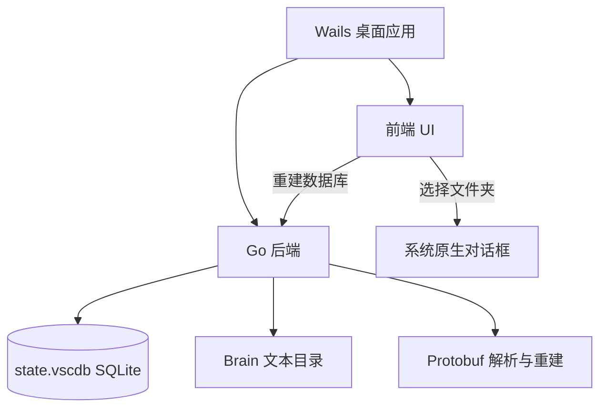

# ⚓ GravityAnchor (引力锚)

[English](README.md) | [简体中文](README_zh.md)

[](https://golang.org)
[](https://wails.io)
[](LICENSE)
[](#)

> [!NOTE]
> **GravityAnchor** 是一款专为 **Antigravity (基于 Gemini 的 AI 编程智能体)** 打造的桌面管理与修复工具。它可以自动扫描、恢复、修补本地对话历史（Conversation Trajectories）以及修复失效的工作区路径（Workspace Links）。

你的 Antigravity 本地对话是否因系统迁移、备份恢复或目录变更而丢失了标题、时间戳或工作区关联？GravityAnchor 旨在帮你轻松一键重建、完美同步。

---

## ✨ 核心功能

- 🔍 **多源数据统一扫描**：自动探测并扫描系统 SQLite 状态数据库（`state.vscdb`）、leveldb 以及本地 `Brain` 文档目录。
- ⚓ **智能工作区绑定**：结合强大的正则分析和已知工作区路径库，智能推断并一键将“丢失关联”的对话重新绑定至本地物理目录。
- 🏷️ **深度标题恢复**：递归解析底层 Protobuf 对话轨迹和 brain 文本记录，完美恢复原始对话标题，告别无意义的 ID 兜底。
- ⏳ **修改时间戳注入**：自动向 Protobuf 对话轨迹记录中注入正确的最后修改时间戳，确保侧边栏列表按时间顺序精准排列。
- 🖥️ **原生文件选择器**：集成操作系统级原生文件夹选择对话框，支持手动微调与关联特定对话的工作区目录。
- 🌐 **双语动态切换**：提供全套中英文国际化，支持在 UI 界面一键无缝切换。

---

## 🛠️ 技术架构

GravityAnchor 采用了极轻量且安全的混合桌面架构：
- **后端 (Go)**：负责底层高性能 SQLite 查询（`ItemTable` 解析）、Base64/Protobuf 消息体的反序列化与编码重建、文件系统扫描归集以及调用系统原生 API。
- **前端 (HTML5/JS/CSS)**：基于 Vanilla 技术栈构建的精美暗黑主题界面，配备平滑毛玻璃特效（Glassmorphism）、微交互动画、分步指引向导以及实时终端日志流。



---

## 🚀 本地开发

请确保你已安装 **Go** (推荐 1.25+) 以及 **Node.js**，然后安装 Wails CLI：
```bash
go install github.com/wailsapp/wails/v2/cmd/wails@latest
```

运行本地实时热重载开发模式：
```bash
wails dev
```

---

## 📦 打包构建

若要编译当前平台对应的优化版独立桌面安装包，请运行：

```bash
wails build
```

编译出的二进制文件将存放在 `build/bin/` 文件夹中。

> [!TIP]
> 在正式发布前，可以通过替换 `build/` 对应平台打包目录下的 `.ico`、`.png` 和 `.icns` 来定制你专属的应用图标。Wails 会在编译时自动进行打包嵌入。

---

## 🛡️ 开源协议

本项目基于 MIT 许可证开源 - 详情请参阅 [LICENSE](LICENSE) 文件。
